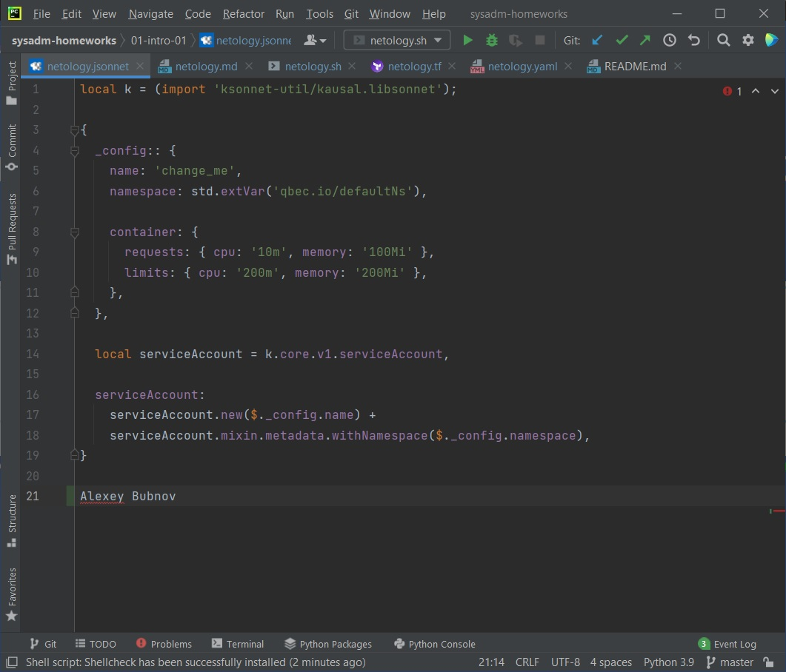
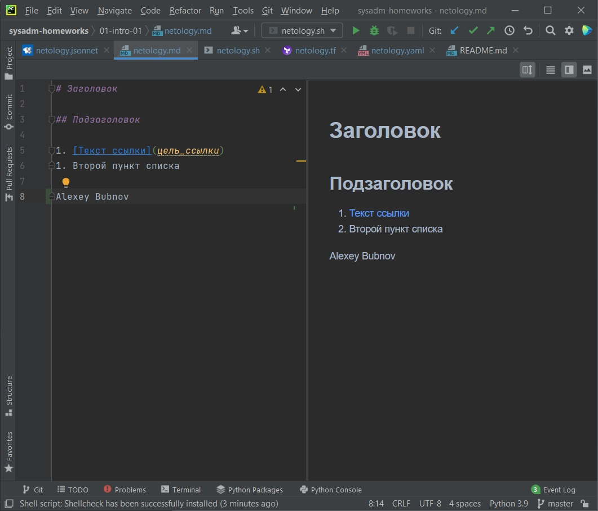
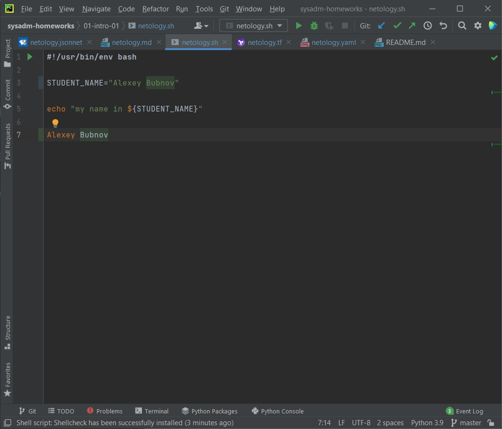
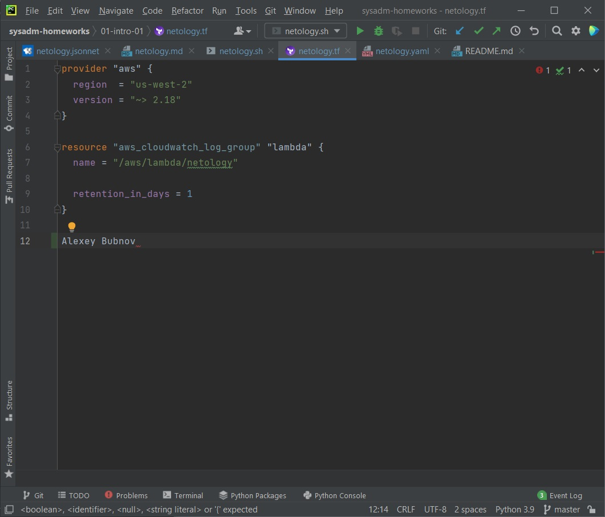
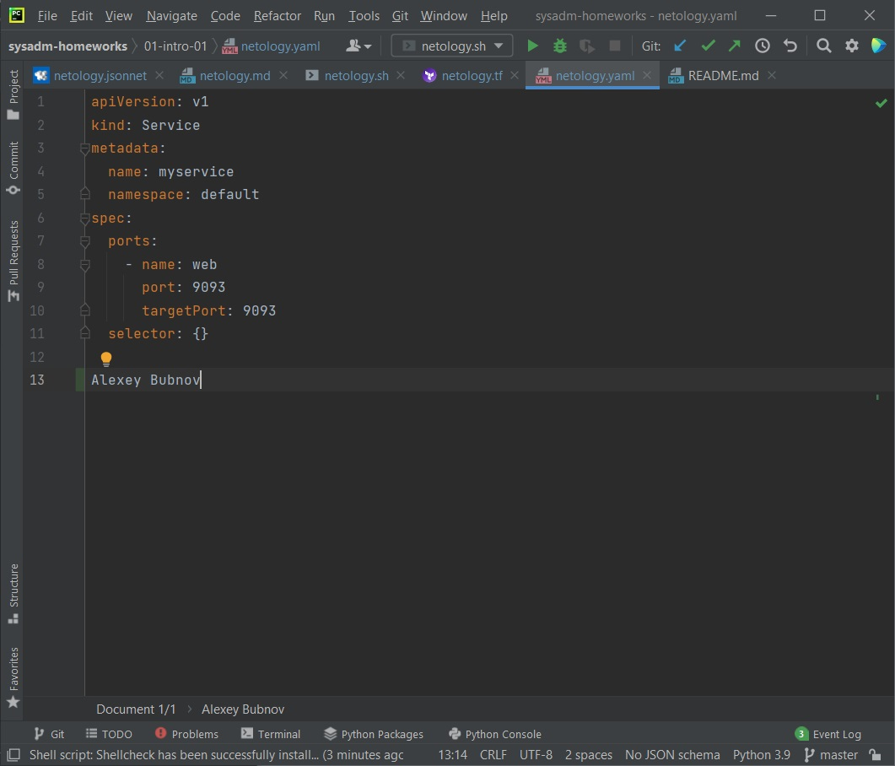

## Задание №1 - Подготовка рабочей среды

Результат настройки рабочей среды:

## Задание №2 - Описание жизненного цикла задачи

Этапы с участием участием DevOps помечены *
- Оцениваетются сроки реализации задания
- Определятся архитектура продукта, инструменты и среды разработки
- Новый код проходит тестирование в специальных, изолированных средах*
- После успешного прохождения всех тестов, готовый билд размещается в демонстрационной среде для показа заказчику*
- Публикуется релиз с добавленным функционалом*
- Новый функционал добавляется к списку мониторинга за состоянием продукта*
