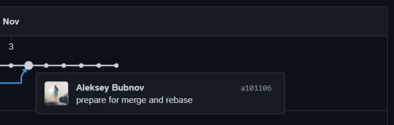

В результате задания:
- итог работы в ветке `git-merge` слит с основной мерж коммитом `7861a7b8` и `3ad3233a`
- итог работы в ветке `git-rebase` перемещен в основную ветку ребейз коммитом `fcebb128` и `f74f8bb3` 

После выполненных действий история основной вытки выглядит линейно:

