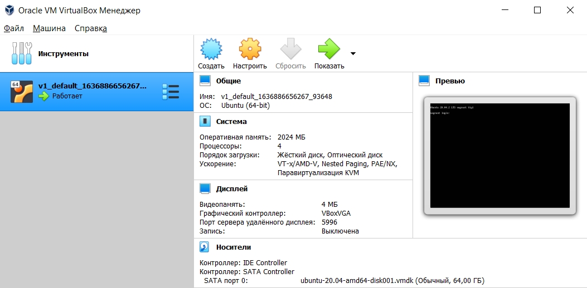
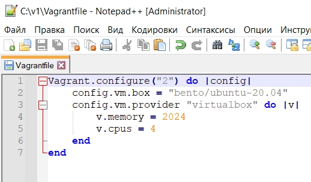
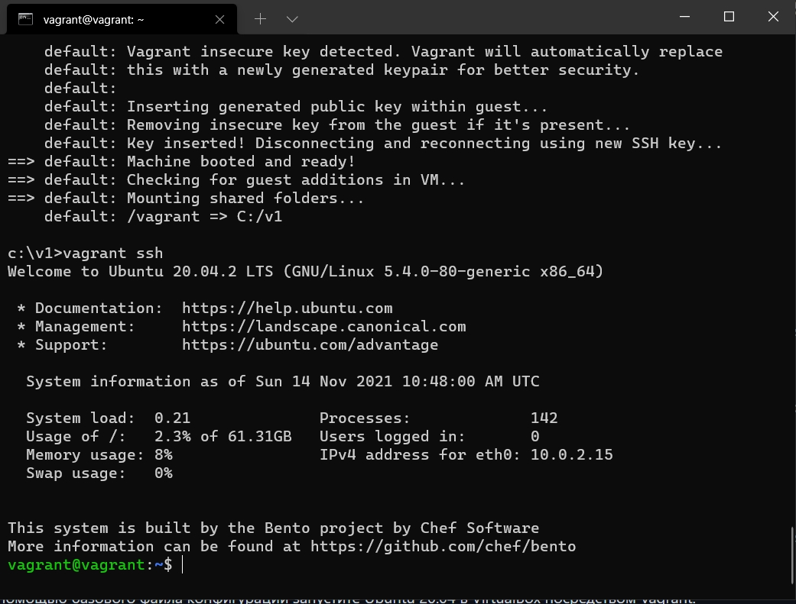

1-7. Выполнено.  
  
  
  
8. Ознакомиться с разделами `man bash`, почитать о настройках самого bash:
   - Строка 692. Длина журнала задается переменной `HISTSIZE`. 
   - Строка 614. `ignoreboth` совмещает `ignorespace` (игнорировать строки начинающие с пробела) и `ignoredups` (игнорировать поторяющиеся строки).
9. В каких сценариях использования применимы скобки `{}` и на какой строчке `man bash` это описано?  
   - Строка 792. Фигурными скобками можно сгруппировать значения в список, чтобы какой либо коммандой получить множество значений. Пример из man: a{d,c,b}e expands into `ade ace abe'.
10. С учётом ответа на предыдущий вопрос, как создать однократным вызовом `touch` 100000 файлов? Получится ли аналогичным образом создать 300000? Если нет, то почему?  
    - `touch file{0..099999}`
    - 300000 создать не удалось, ограничение буфера аргументов.  
    `-bash: /usr/bin/touch: Argument list too long`
11. В man bash поищите по `/\[\[`. Что делает конструкция `[[ -d /tmp ]]`
    - Конструкция проверяет, существует ли директория `/tmp`
12. Основываясь на знаниях о просмотре текущих (например, PATH) и установке новых переменных; командах, которые мы рассматривали, добейтесь в выводе type -a bash в виртуальной машине наличия первым пунктом в списке:  
    - `vagrant@vagrant:~$ mkdir /tmp/new_patch_directory `  
    `vagrant@vagrant:~$ cp /bin/bash /tmp/new_patch_directory/`  
    `vagrant@vagrant:~$ PATH=/tmp/new_patch_directory/:$PATH`  
    `vagrant@vagrant:~$ type -a bash`  
    `bash is /tmp/new_patch_directory/bash`  
    `bash is /usr/bin/bash`  
    `bash is /bin/bash`  
13. Чем отличается планирование команд с помощью `batch` и `at`?
    - `batch` - выполнит команду при определенной нагрузке системы
    - `at` - выполнит команду в указанное время
14. Завершите работу виртуальной машины чтобы не расходовать ресурсы компьютера и/или батарею ноутбука.
    - При выключении виртуальной машины ни одна электростанция не пострадала