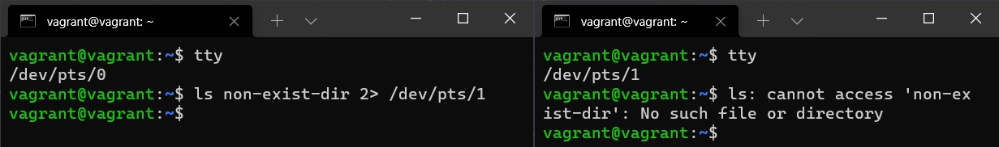
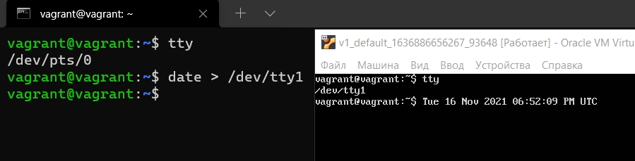

1. Какого типа команда `cd`? Попробуйте объяснить, почему она именно такого типа; опишите ход своих мыслей, если считаете что она могла бы быть другого типа.**  
```
cd - это встроенная команда, не имеющая своего процесса\файла и работающая только в оболочке командной строки.  
```
2. Какая альтернатива без pipe команде `grep <some_string> <some_file> | wc -l`?
```
$ grep -c <some_string> <some_file>
```
3. Какой процесс с PID 1 является родителем для всех процессов в вашей виртуальной машине Ubuntu 20.04?
```
$ ps -f -p 1
UID          PID    PPID  C STIME TTY          TIME CMD
root           1       0  0 19:00 ?        00:00:01 /sbin/init
```
4. Как будет выглядеть команда, которая перенаправит вывод stderr `ls` на другую сессию терминала?
```
$ ls non-exist-dir 2> /dev/pts/1
```


5. Получится ли одновременно передать команде файл на stdin и вывести ее stdout в другой файл? Приведите работающий пример.
```
$ ls > folder-list.txt
$ wc -l <folder-list.txt >strings-count.txt
$ cat strings-count.txt
8
```
6. Получится ли вывести находясь в графическом режиме данные из PTY в какой-либо из эмуляторов TTY? Сможете ли вы наблюдать выводимые данные?
```
$ date > /dev/tty1
```

7. Выполните команду `bash 5>&1`. К чему она приведет? Что будет, если вы выполните `echo netology > /proc/$$/fd/5`? Почему так происходит?
>Команда `bash 5>&1` создаст файловый дискриптор с номером `5` и направит его вывод в `stdout`. Если выполнить `echo netology > /proc/$$/fd/5`, то `stdout` команды `echo` будет отправлен в файловый дискритор `5`, вывод которого отправляется на терминал. В результате, в командной строке терминала будет выведена надпись `netology` 
8. Получится ли в качестве входного потока для pipe использовать только stderr команды, не потеряв при этом отображение stdout на pty?
```
$ bash 10>&1
$ ls -d dir non-exist-dir1 non-exist-dir1 2>&1 1>/proc/$$/fd/10 | tee errors.txt
dir
ls: невозможно получить доступ к 'non_exist_dir1': Нет такого файла или каталога
ls: невозможно получить доступ к 'non_exist_dir2': Нет такого файла или каталога
$ cat errors.txt
ls: невозможно получить доступ к 'non_exist_dir1': Нет такого файла или каталога
ls: невозможно получить доступ к 'non_exist_dir2': Нет такого файла или каталога
```
9. Что выведет команда `cat` /proc/$$/environ? Как еще можно получить аналогичный по содержанию вывод?
>Команда выводит переменные окружения для текущего процесса bash  
> Команда `env` покажет большее количество переменных окружения
10. Используя `man`, опишите что доступно по адресам `/proc/<PID>/cmdline`, `/proc/<PID>/exe`
>`/proc/<PID>/cmdline` - Этот файл содержит полную командную строку запуска процесса, кроме тех процессов, что полностью ушли в своппинг, а также тех, что превратились в зомби.  
>`/proc/<PID>/exe` - Под Linux 2.2 и 2.4 exe является символьной ссылкой, содержащей фактическое полное имя выполняемого файла.
11. Узнайте, какую наиболее старшую версию набора инструкций SSE поддерживает ваш процессор с помощью `/proc/cpuinfo`.  
>`sse4_2`
12. При открытии нового окна терминала и `vagrant ssh` создается новая сессия и выделяется pty. Это можно подтвердить командой tty, которая упоминалась в лекции 3.2. Однако:  
```
vagrant@netology1:~$ ssh localhost 'tty'
not a tty
```
Почитайте, почему так происходит, и как изменить поведение.
>Нужно выполнить ту же команду с ключом -t
13. Бывает, что есть необходимость переместить запущенный процесс из одной сессии в другую. Попробуйте сделать это, воспользовавшись `reptyr`. Например, так можно перенести в screen процесс, который вы запустили по ошибке в обычной SSH-сессии.  
>`reptyr -T <PID>`, чтобы завершить перехваченную сессию нужно использовать `exit`
14. `sudo echo string > /root/new_file` не даст выполнить перенаправление под обычным пользователем, так как перенаправлением занимается процесс shell'а, который запущен без `sudo` под вашим пользователем. Для решения данной проблемы можно использовать конструкцию `echo string | sudo tee /root/new_file`. Узнайте что делает команда `tee` и почему в отличие от `sudo echo` команда с `sudo tee` будет работать.
>В первом варианте bash запущен с правами обычного пользователя и при попытке записать строку в файл будет получена ошибка  
>Во втором варианте tee с повышенными правами получает ввод из пайп и выводит его в стандартный вывод